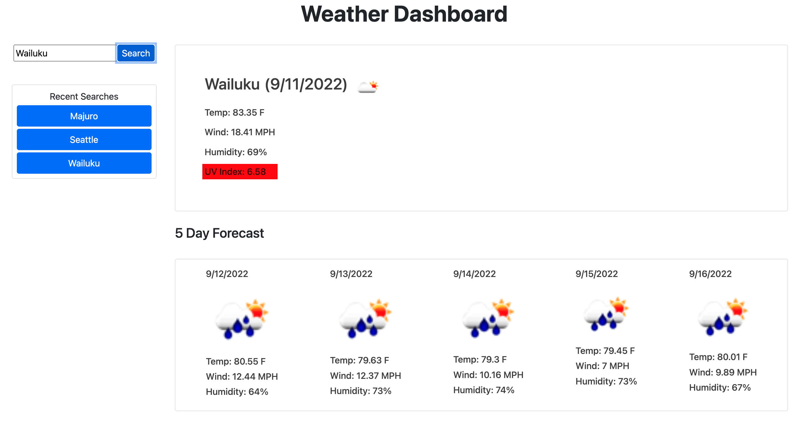

# Weather_Forecast-SERVER_SIDE_API

  ## Description

  This application will render a 5-day forecast of your favorite cities using the OpenWeather One Call API to retrieve to weather data.

  ## Live Page
  [LIVE LINK](https://fyerra1.github.io/weather_dashboard-SERVER_SIDE_API/)

  ## Screenshots:
  

  ## Table of Contents
  #### [Usage](#usage)
  #### [Contribution](#contribution)
  #### [License](#license)
  #### [Contact](#questions)

  ## Usage
  - Landing Page:
    - Enter city name
    - Or select a city from a list of your recent searches
  - Dashboard:
    - View a 5-day forcast of a city
    - Select a city from a list of your recent searches 
    
  ## Contribution

  - Submit a pull request

  ## License

  

  ## Questions?

  Github: [fyerra](https://github.com/fyerra)
  E-mail: frankyerra1@gmail.com